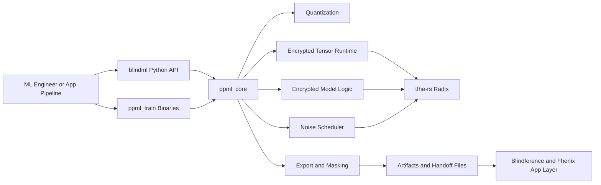
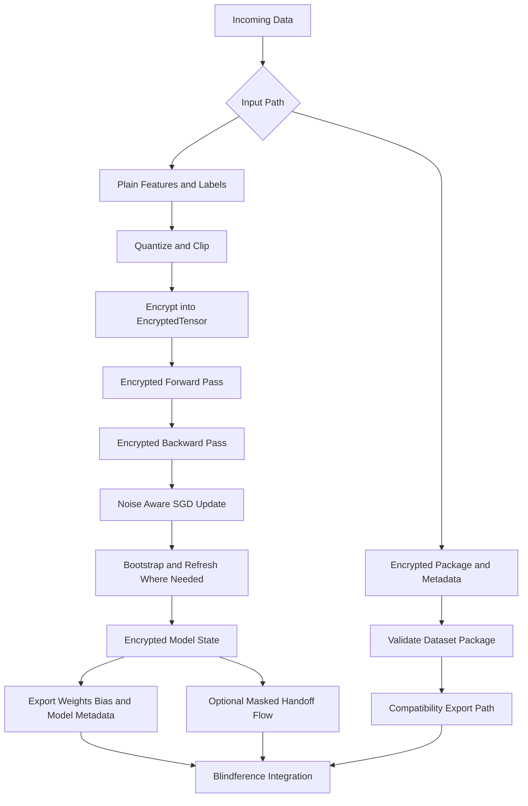
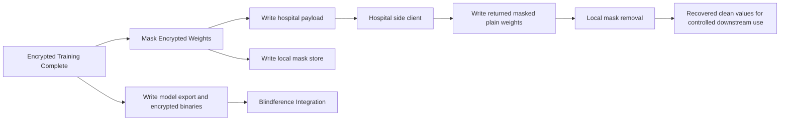

[](#)
[](#)
[](#)
[](#)

# PPML

PPML is the encrypted ML/statistics layer for Fhenix-compatible system repository that powers the training side of the Blindference stack.

It is designed as an off-chain, Fhenix-compatible ML layer built on `tfhe-rs` radix. In practice, that means PPML gives ML engineers a Rust engine and a Python-facing abstraction for training and exporting models over encrypted data, while the companion `blindference` repository handles wallets, contracts, web flows, and on-chain confidential inference.

In short:

- `PPML` is the encrypted ML and statistics layer
- `blindference` is the application, marketplace, and Fhenix execution layer

## What This Repository Solves

PPML exists to make fully encrypted model development practical enough to plug into a Fhenix-based system.

It provides:

- encrypted tensor operations over `tfhe-rs` radix ciphertexts
- a trainable encrypted logistic-regression pipeline
- noise-aware forward pass, backward pass, and SGD update flow
- export formats for downstream deployment and integration
- a Python abstraction for ML engineers who do not want to work directly in Rust
- compatibility bridges for encrypted dataset packages coming from the broader Fhenix/Blindference workflow
- masking and handoff utilities for workflows that need controlled off-path decryption before local post-processing

## Fhenix Compatibility

PPML is not an on-chain package. It is an off-chain engine designed to be compatible with a Fhenix-centered system.

That compatibility shows up in three ways:

- exported model artifacts are structured for downstream ingestion by the Blindference deployment layer
- encrypted dataset compatibility tooling is designed around CoFHE-style encrypted payloads and metadata contracts
- the repository focuses on the encrypted training and statistical layer that sits behind Fhenix-powered confidential applications

So while `blindference` handles encrypted inference inside the Fhenix ecosystem, PPML gives that ecosystem an ML training layer.

## Architecture



## Layered Design

### 1. `ppml_core`

`ppml_core` is the cryptographic and mathematical source of truth.

It contains:

- `FheContext` for CPU and optional GPU backends
- fixed-point quantization config and quantizers
- `EncryptedTensor` and encrypted tensor operations
- logistic model forward and backward passes
- SGD updates
- export, compatibility, and masking utilities
- dataset and metadata validators for encrypted package intake

This layer owns the actual encrypted computation.

### 2. `blindml`

`blindml` is the Python abstraction built with PyO3 and Maturin.

It exists so ML engineers can interact with PPML through a notebook-friendly API instead of writing Rust directly.

It exposes:

- `BlindContext.generate()`
- `BlindLogisticRegression(...)`
- `fit(...)`
- `export_model(...)`
- encrypted package validation helpers for the current PoC flow

This is the main developer-facing layer for Python users.

### 3. `ppml_train`

`ppml_train` contains executable binaries for local development, testing, and export workflows.

The current binaries are:

- `train`: runs the encrypted training loop and writes deployment and handoff artifacts
- `infer`: performs local CPU inference from exported encrypted weights and bias
- `hospital_client`: decrypts masked weights and writes the return payload used in the handoff flow

## Full Training Lifecycle



## How Data Enters PPML

PPML currently supports two practical input paths.

### Path 1. Native encrypted training flow

This is the main training path implemented in the Python wrapper and Rust engine.

The flow is:

1. A user supplies feature and label arrays.
2. PPML quantizes and clips those values into the current fixed-point regime.
3. The values are encrypted locally into `EncryptedTensor` objects.
4. Training runs fully over encrypted tensors.
5. The trained encrypted model is exported for downstream use.

This is the path used by the current Python training flow and the Pima-based example.

### Path 2. Encrypted package compatibility flow

This is the current intake bridge for encrypted dataset payloads already produced upstream.

The flow is:

1. An encrypted dataset JSON payload and metadata JSON are received.
2. PPML validates structure, shape, and metadata consistency.
3. The package can be re-exported into a compatibility-oriented model artifact for integration testing and downstream handoff.

In this repository snapshot, this path is a compatibility and validation bridge rather than the main full-training path.

## How Encrypted Training Works

### 1. Context and keys

Training starts by loading or generating TFHE keys through `FheContext`.

PPML caches these keys locally so repeated development runs do not pay the full key-generation cost every time.

The engine supports:

- CPU mode by default
- optional GPU mode through Cargo features when CUDA is available

### 2. Quantization and preprocessing

Before encryption, PPML converts floating-point values into a fixed-point integer regime.

The current code exposes a `q16f8()` compatibility profile, which in this Wave 1 snapshot maps to the lighter demo quantization regime used by the training engine. This is part of the current practical tradeoff to keep encrypted training feasible in the prototype stage.

### 3. Encryption into tensors

After quantization, PPML encrypts features and labels into `EncryptedTensor` values.

These tensors are:

- shape-aware
- serializable
- noise-tracked
- reusable across forward, backward, optimization, export, and handoff steps

### 4. Encrypted forward pass

The model performs:

- encrypted matrix multiplication
- encrypted bias addition
- fused truncate and sigmoid-style LUT activation

This is the main scoring path for encrypted logistic regression.

### 5. Encrypted backward pass

The backward pass computes:

- encrypted prediction error
- encrypted weight gradients
- encrypted bias gradients

This allows PPML to train without leaving encrypted space during the core update loop.

### 6. Noise management and refresh

A key challenge in FHE training is noise growth.

PPML manages this with:

- a `NoiseScheduler`
- targeted bootstrapping before risky operations
- explicit force-refresh steps during model updates
- approximate truncation in the gradient path where appropriate

This noise-management layer is one of the main reasons fully encrypted training is possible in the current prototype.

### 7. SGD update

The optimizer applies quantized SGD to encrypted weights and bias.

The update path scales gradients, subtracts them from encrypted parameters, and refreshes model state to keep further training steps viable.

## Python Abstraction

The Python package is the easiest way to work with PPML as an ML engineer.

### Example

```python
import blindml

context = blindml.BlindContext.generate()
model = blindml.BlindLogisticRegression(input_features=2)

model.fit(
    context,
    x_train,
    y_train,
    epochs=10,
    batch_size=32,
    learning_rate=0.1,
)

model.export_model("./")
```

### What the Python layer gives you

- automatic key initialization
- encrypted training orchestration
- a simpler API surface for experimentation
- export helpers for deployment-oriented artifacts
- compatibility helpers for encrypted package validation in the PoC flow

## Artifacts Produced By PPML

After training and export, PPML can write several files depending on the workflow:

| Artifact | Purpose |
| --- | --- |
| `fhe_keys.bin` | cached TFHE keys for local reuse |
| `fhenix_weights.bin` | serialized encrypted weight tensor |
| `fhenix_bias.bin` | serialized encrypted bias tensor |
| `model_export.json` | deployment-oriented model export and metadata |
| `local_mask.json` | locally retained masking data for handoff recovery |
| `hospital_payload.json` | masked encrypted weights prepared for external decrypt-return flow |
| `hospital_returned_plain.json` | decrypted masked values returned by the hospital-side client |

## Export and Handoff Flow



### Why the handoff exists

The masking and handoff path is a practical bridge for workflows where an external party performs a decrypt-return step, while the training side keeps the unmasking information locally.

The end result is:

- the external side sees only masked values
- the local side keeps the mask store
- the workflow can recover usable returned values without exposing the original unmasked parameters to the external party

## Repository Layout

```text
PPML/
├── blindml/                   Python extension layer built with PyO3
├── ppml_core/                 Core encrypted tensor and training engine
├── ppml_train/                Rust binaries for training inference and handoff
├── poc_integration/           Compatibility PoC with upstream encrypted package flow
├── scripts/                   Helper scripts
├── run_poc.sh                 End-to-end PoC wrapper
├── test_blindml.py            Pima-based Python training example
├── requirements.txt           Python dependencies
└── readme.md                  Repository documentation
```

## Installation

### Prerequisites

- Rust toolchain
- Python
- `pip`
- `maturin`
- optional NVIDIA CUDA environment for GPU builds

### 1. Create a Python environment

```bash
cd PPML
python3 -m venv .venv
source .venv/bin/activate
pip install --upgrade pip
pip install -r requirements.txt
```

### 2. Build the Python package

```bash
maturin develop --release -m blindml/Cargo.toml
```

### 3. Optional GPU build

If you have a supported CUDA environment:

```bash
maturin develop --release -m blindml/Cargo.toml --features gpu
```

## How To Use PPML

### Option 1. Train with the Python API

This is the recommended path for ML engineers.

```bash
cd PPML
source .venv/bin/activate
python test_blindml.py
```

This example:

- loads a public Pima diabetes dataset
- selects a smaller feature subset for the current encrypted regime
- encrypts the training data inside PPML
- trains an encrypted logistic-regression model
- exports encrypted deployment artifacts

### Option 2. Run the Rust training binary

```bash
cd PPML
cargo run -p ppml_train --bin train
```

This path runs the native encrypted training binary and writes the export and handoff files in the repository root.

### Option 3. Run local inference from exported artifacts

```bash
cd PPML
cargo run -p ppml_train --bin infer -- <feature_1> <feature_2> ...
```

Provide one feature value per exported model input dimension.

### Option 4. Run the hospital handoff client

```bash
cd PPML
cargo run -p ppml_train --bin hospital_client
```

### Option 5. Run the compatibility PoC

```bash
cd PPML
bash run_poc.sh
```

This PoC:

- encrypts a toy dataset upstream using the Hardhat CoFHE environment
- validates the encrypted package in PPML
- exports a compatibility model artifact for integration testing

This path expects the sibling `blindference/fhenix_inference` workspace to exist locally.

## Using PPML With Blindference

The intended system-level workflow is:

1. receive or prepare data
2. train or validate within PPML
3. export encrypted model artifacts
4. hand those artifacts to `blindference`
5. let `blindference` handle web flows, storage, contracts, and Fhenix-side inference

This is what makes PPML the off-chain ML layer behind the Fhenix product stack.

## Current Wave 1 Status

What is already implemented:

- encrypted logistic-regression training over `tfhe-rs` radix tensors
- CPU training and optional GPU build path
- Python abstraction through `blindml`
- encrypted tensor serialization and export
- compatibility utilities for incoming encrypted dataset packages
- masking and external handoff flow
- deployment-oriented export artifacts for downstream integration

## Next Wave Improvements

The next waves of PPML are focused on performance, stronger provenance, and broader model support.

### 1. Faster encrypted training

We plan to improve:

- packing and batching efficiency
- better use of GPU acceleration paths
- lower ciphertext operation overhead
- more scalable training loops for larger datasets

### 2. Stronger Fhenix compatibility and provenance

We plan to deepen:

- dataset-to-model traceability
- tighter export contracts for Blindference integration
- stronger compatibility with deployment-oriented Fhenix flows

### 3. Verifiable training

We want to pair PPML training with zero-knowledge provenance layers so downstream systems can verify that:

- training used the committed dataset
- model artifacts correspond to the claimed data lineage
- the training flow remained consistent without exposing private raw data

### 4. Broader encrypted ML support

We also plan to expand beyond the current Wave 1 logistic-regression focus toward richer encrypted model families and better ML-engineer ergonomics.

## Project Links

- Blindference repository: `https://github.com/baync180705/blindference`
- PPML repository: `https://github.com/abhishekpanwarr/PPML`

## Position In The Stack

PPML should be understood as the encrypted ML engine behind the application stack.

It does not try to be:

- a smart-contract repo
- a web application repo
- a wallet UX repo
- a deployment dashboard

Instead, it is the part of the system that gives Fhenix-compatible applications an off-chain ML and statistical training layer built on encrypted computation.
